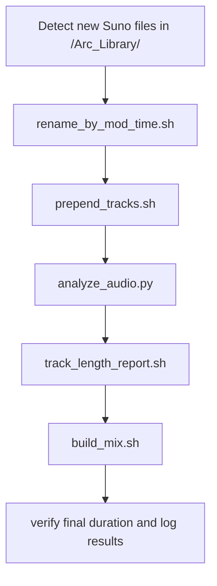

# 🤖 Static Dreamscapes — AI Agent Reference

> Documentation for the **Python agent layer** of the Static Dreamscapes Automation System.  
> The agent handles orchestration, analysis, and metadata management — serving as the intelligent core of the automated pipeline.

All Python logic lives in `/agent/`.  
This layer communicates with the shell utilities in `/scripts/` and manages the end-to-end workflow from track ingestion to rendered mix.

---

## 🧩 Overview

| Component          | File                                      | Description                                                                |
| ------------------ | ----------------------------------------- | -------------------------------------------------------------------------- |
| **Orchestrator**   | [`orchestrator.py`](#1️⃣-orchestratorpy)   | Central controller that coordinates all stages of the pipeline.            |
| **Audio Analyzer** | [`analyze_audio.py`](#2️⃣-analyze_audiopy) | Uses `librosa` to extract musical features and update structured metadata. |

---

## 1️⃣ `orchestrator.py`

**Location:** `agent/orchestrator.py`  
**Depends on:** Bash scripts in `/scripts/`, `analyze_audio.py`, `os`, `subprocess`, `json`, `time`, `logging`

---

### 🧠 Purpose

The orchestrator is the **central automation brain**.  
It detects new Suno-generated audio files, waits for downloads to complete, then executes all stages of the production pipeline in sequence.

It is responsible for:

- Running shell scripts (`rename_by_mod_time.sh`, `prepend_tracks.sh`, etc.)
- Calling `analyze_audio.py` at the correct point
- Handling logging, error catching, and pipeline recovery
- Writing merged metadata JSONs in `/metadata/`
- Triggering the final FFmpeg mix build

---

### ⚙️ Typical Execution Flow



---

### 🧾 Responsibilities by Phase

| Phase              | Description                                                                 | Trigger Type      |
| ------------------ | --------------------------------------------------------------------------- | ----------------- |
| 1. Detection       | Watches `/Arc_Library/` for new .mp3 files using watchdog or timed polling. | Automatic         |
| 2. Preparation     | Executes renaming and prefixing scripts in order.                           | Sequential        |
| 3. Analysis        | Runs `analyze_audio.py` to collect musical data.                            | Python subprocess |
| 4. Validation      | Calls `track_length_report.sh` to verify cumulative duration.               | Sequential        |
| 5. Rendering       | Calls `build_mix.sh` to produce final 3-hour mix.                           | Sequential        |
| 6. Logging & Merge | Updates `/metadata/song_index.json` and pipeline logs.                      | Internal          |

---

### 🧩 Example Invocation

```bash
python3 agent/orchestrator.py
```

This will:

1. Wait for new Suno files in `/Arc_Library/`
2. Execute all required shell scripts in order
3. Call `analyze_audio.py`
4. Produce updated metadata + rendered mix in `/Rendered/`

---

### 📤 Outputs

- `logs/orchestrator.log` — execution trace
- Updated metadata under `/metadata/`
- `Rendered/Final_Mix.mp3` — finished 3-hour audio file

---

### 🪢 Agent Integration Notes

- Return code 0 = success; any other = failure.
- The orchestrator must halt on failed shell scripts, except for non-critical analysis steps.
- It should skip redundant runs if no new tracks are detected.
- On success, it appends a summary JSON entry to `metadata/build_history.json`.

---

## 2️⃣ `analyze_audio.py`

**Location:** `agent/analyze_audio.py`  
**Depends on:** `librosa`, `json`, `os`, `numpy`, `logging`

---

### 🧠 Purpose

Analyzes every `.mp3` file within `/Arc_Library/` and extracts key musical and acoustic data for metadata structuring.
Outputs detailed JSON files per phase and an aggregated index used for later curation or playlist creation.

---

### ⚙️ Features Extracted

| Attribute      | Description                                          |
| -------------- | ---------------------------------------------------- |
| `duration_sec` | Total track duration in seconds                      |
| `bpm`          | Estimated tempo using onset detection                |
| `rms`          | Average loudness (Root Mean Square)                  |
| `brightness`   | Mean spectral centroid — represents tonal brightness |
| `key_guess`    | Estimated musical key via chroma features            |

---

### 📥 Inputs

- `/Arc_Library/Phase_1_Calm_Intro/`
- `/Arc_Library/Phase_2_Flow_Focus/`
- `/Arc_Library/Phase_3_Uplift_Clarity/`
- `/Arc_Library/Phase_4_Reflective_Fade/`

---

### 📤 Outputs

| File                        | Description                          |
| --------------------------- | ------------------------------------ |
| `/metadata/Phase_X.json`    | Structured metadata for each phase   |
| `/metadata/song_index.json` | Master index for all analyzed tracks |
| `logs/orchestrator.log`     | Log entries appended                 |

---

### ⚙️ Example Usage

Run manually:

```bash
python3 agent/analyze_audio.py
```

Or automatically (called by orchestrator):

```python
subprocess.run(["python3", "agent/analyze_audio.py"])
```

---

### 🧩 Agent Integration Notes

- Should return code 0 when analysis completes successfully.
- Automatically overwrites older metadata with fresh analysis results.
- Handles skipped or missing files gracefully (logs warnings, not errors).
- Can be imported as a function:

```python
from agent.analyze_audio import analyze_audio_batch
analyze_audio_batch("/Arc_Library/", "/metadata/")
```

---

## 🧠 Data Flow Summary

```mermaid
graph TD
  A[/Arc_Library/ new Suno tracks] --> B[orchestrator.py]
  B --> C[rename_by_mod_time.sh]
  C --> D[prepend_tracks.sh]
  D --> E[analyze_audio.py]
  E --> F[/metadata/ JSON updates]
  F --> G[track_length_report.sh]
  G --> H[build_mix.sh]
  H --> I[/Rendered/ Final Mix]
```

---

## 🧾 Logging Standards

All agent actions log to `logs/orchestrator.log` in the format:

```
[TIMESTAMP] [MODULE] Status: SUCCESS | WARNING | ERROR
Details: <description>
```

Examples:

```
[2025-10-29 23:31:04] [analyze_audio.py] Status: SUCCESS — 12 files analyzed.
[2025-10-29 23:34:22] [build_mix.sh] Status: SUCCESS — Final mix rendered (02:58:44).
```

---

## 🧰 Maintenance Notes

- Both scripts must remain in `/agent/` to preserve import paths.
- `analyze_audio.py` should avoid external dependencies beyond `librosa` and `numpy`.
- Ensure FFmpeg and librosa are installed system-wide before running.
- The orchestrator should handle `.sh` script failures with `subprocess.CalledProcessError` handling.
- Logs are rotated automatically after successful renders.

---

## ✅ Related Documentation

- `04_AI_AGENT_WORKFLOW.md` — detailed pipeline logic
- `05_AUDIO_ANALYSIS.md` — deep dive into librosa feature extraction
- `06_SCRIPT_DEFINITIONS.md` — shell script descriptions
- `../scripts/README_SCRIPTS.md` — mechanical layer reference
